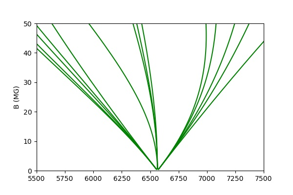

# Snippet_Zeeman_splitting

This python function generates the Zeeman splitting diagrams for hydrogen (aka "spaghetti plots"). These show the effect on the hydrogen lines of varying magnetic field strengths. It is based based on the atomic data by Schimeczek & Wunner (2014ApJS..212...26S), which was downloaded from  https://doi.org/10.18419/darus-2118. 

If you use this function, please cite Inight et al. (2023MNRAS.524.4867I) and Schimeczek & Wunner (2014ApJS..212...26S).

## Prerequisites
This is entirely python code using standard modules that 
are included in the Anaconda distribution. The data files (approx 300Mb) 
need to be in the same directory as the code.
        
This code has been designed to be portable and should work on 
Linux, Windows and Mac. It has been tested using Python 3.8 under 
Ubuntu 18.04 and also under Windows 10.

## Example
The curves for Halpha are plotted when the module is executed. 

    

